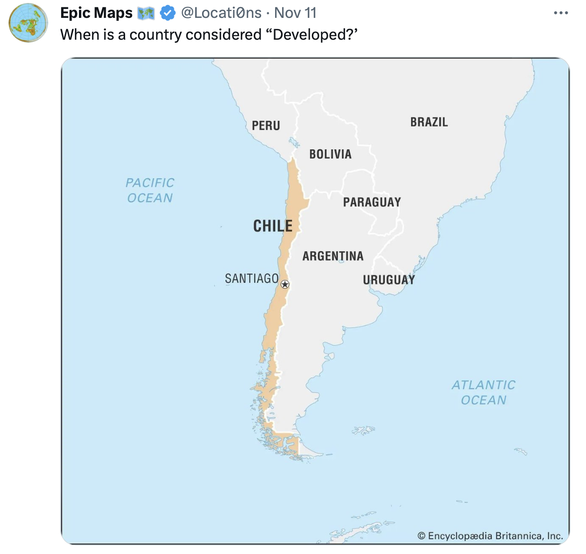

**Instructions** Due date is December 11, 5pm. You are allowed to use any of your notes, textbook, or resources from the internet, but you are strictly prohibited to communicate with any other person (including me!) while you complete your final exam. Make sure to interpret your results clearly when indicated. Your score will be 70% based on the accuracy of your code, 20% interpretation, and 10% clarity in code annotations. Good luck! (Note: you are allowed to reach out to me for any clarification questions.)

Each question is worth 6.25 points.


```{r echo=FALSE}

# Custom options for knitting, you can keep this as it is.
knitr::opts_chunk$set(
  message = FALSE,
  warning = FALSE,
  error = FALSE, 
  fig.align = "center",
  fig.width = 4,
  fig.height = 4,
  cache = FALSE
) 

# turn off scientific notation
options(scipen=5)
```

# Part 1

Here is a tweet that motivates this question:


{width=50%}

So, the question is, when is a country considered "developed"? You will use clustering to tackle on this question. Here is a real-world data set which covers all countries in the world, and is stored in the same folder as this exam called `countries.csv`.

Read the data in via

```{r}
library(tidyverse)
countries <- read.csv("countries.csv")
countries <- countries %>% drop_na(gdp,pop,life) # let's drop rows with missing obs
```

`year`: year
`code`: 3-digit country code \
`pop`: population \
`gdp`: gross domestic product \
`life`: average life expectancy in years \
`cell`: cell phone usage \
`imports`: total value of imports \
`exports`: total value of exports \

Let's use a crude but still useable measure to approximate how developed a country is. Let's use two variables: gdp per capita, (defined as `gdp` divided by `pop`), and `life`.

Let's assume three clusters (k=3) which should correspond to: underdeveloped, developing, developed.

# Question 1
First, filter countries to those with `pop>1`, given that small countries are more difficult to deal with when we want to make generalizations. Split the countries into 3 clusters using hierarchical clustering with manhattan-distance (since computational power-wise we need to be efficient given ~9,000 obs we have) and complete linkage clustering. Make a scatterplot with `gdp_per_capita` on the x axis and `life` on the y axis. Color each point differently based on their cluster assignment. Note that you need to create `gdp_per_capita`, as defined above. How many countries are there in each cluster? (Hint: `unique()` function can come in handy here.)

```{r}


```


# Question 2
Now that we have our clusters, let's do some exploration. Let's check Afghanistan (code='AFG'). Return Afghanistan's observations. In 1960, which cluster did Afghanistan belong to? Did Afghanistan experienced an improvement in their cluster assignment across years? If so, when, and which variable appears to be the main driver for it?

```{r}

```

# Question 3
Okay, let's now repeat for USA (code='USA'). In 1960, what is USA's cluster assignment? Do you think this result is surprising? Explain why you got this result.

```{r}

```

# Question 4
Compare when USA and Norway (code='NOR') reached to "developed" status.

```{r}

```

# Question 5
Now, let's focus on a specific year: 1990. First, remove the `pop` filter you placed earlier. Filter the data to the year 1990. Repeat your work from Question 1. What cluster does USA belong to? Are the results different than what you observed in Question 3, for the year 1990? Why? Please explain.

```{r}

```


# Question 6
Let's go back to the entire dataset with only the `pop>1` filter. Return the list of countries that reached to "developing" status at most. (Hint: `as.numeric()` function can come handy here, which converts a factor variable to integer values.) How many countries are there that could reach to the developing status at most? Compare this number to the number of countries that reached to "developed" status.

```{r}

```

# Question 7
Return the top 5 countries that spent the fewest number of years between "developing" and "developed" statuses.

```{r}

```

# Question 8
Repeat Questions 1-3, but instead of hierarchical clustering, use k-means with k=3. Do you observe any differences in your result? Are they consequential? Explain.

```{r}

```


# Part 2
In this part, you will work with a personalities dataset. The data are self-reported as part of an online survey and come from Cattell's 16 Personality Factors Test (16PF) which is a personality tool (similar to Myers Briggs or Big Five personality tests if you are familiar with those) which scores individuals based on different psychological traits they exhibit.

The 16PF works with scoring, so it does not put individuals into groups based on their scoring. You will try to do this using clustering.

A codebook is posted in the same folder as this exam, called `personality-codebook.html`. You will see there the questions individuals were asked. These questions focus on certain personality traits. In particular, questions under

A focus on 'warmth' \
B focus on 'reasoning' \
C focus on 'emotional stability' \
D focus on 'dominance' \
E focus on 'liveliness (extroversion)' \
F focus on 'obeying-rules' \
G focus on 'anxiety' \
H focus on 'sensitivity' \
I focus on 'trust' \
J focus on 'abstractedness' \
K focus on 'reservedness' \
L focus on 'confidence' \
M focus on 'openness to change' \
N focus on 'self-reliance (introversion)' \
O focus on 'perfectionism' \
P focus on 'tension'. \

First, read the data in via

```{r}
personality <- read.csv('personality.csv')
personality <- personality %>% filter(score!=0) # get rid of missing values
```

Note that some of the questions in the codebook, despite being under the same category, have a "reversed" scale. For example observe A1 and A8. A larger number in A1 would indicate higher warmth, but a larger number for A8 would indicate lower warmth. We need to fix this via reversing the scale for such questions, which the chunk below does:

```{r}
personality <- personality %>%
  mutate(score = ifelse(
    (question_type == "A" & question_number %in% c(8, 9, 10)) |
    (question_type == "B" & question_number %in% c(9, 10, 11, 12, 13)) |
    (question_type == "C" & question_number %in% c(6, 7, 8, 9, 10)) |
    (question_type == "D" & question_number %in% c(7, 8, 9, 10)) |
    (question_type == "E" & question_number %in% c(7, 8, 9, 10)) |
    (question_type == "F" & question_number %in% c(6, 7, 8, 9, 10)) |
    (question_type == "G" & question_number %in% c(6, 7, 8, 9, 10)) |
    (question_type == "H" & question_number %in% c(7, 8, 9, 10)) |
    (question_type == "I" & question_number %in% c(7, 8, 9, 10)) |
    (question_type == "J" & question_number %in% c(8, 9, 10)) |
    (question_type == "K" & question_number %in% c(6, 7, 8, 9, 10)) |
    (question_type == "L" & question_number %in% c(8, 9, 10)) |
    (question_type == "M" & question_number %in% c(6, 7, 8, 9, 10)) |
    (question_type == "N" & question_number %in% c(8, 9, 10)) |
    (question_type == "O" & question_number %in% c(6, 7, 8, 9, 10)) |
    (question_type == "P" & question_number %in% c(8, 9)),
    6 - score,
    score
  ))
```


# Question 1

Let's check if the scores move in the direction we'd expect them to move. Should you expect respondents who scored high on question `D1` to score high or low in question `D2`?. For those who reported a score of 5 from question `D1`, create a barplot showing the distribution of their scores from question `D2`. Are the scores distributed in the way you expect? Explain and interpret.

```{r}

```

# Question 2

Let's try clustering respondents to groups. First, read a reshaped version of the data where each question gets its own column. That's what we need when we do clustering.

```{r}
personality_reshaped <- read.csv('personality-reshaped.csv',sep='')
```

Now, create an elbow plot for clustering solutions between k=1 through 25. Refer to Page 14 in the `Lecture 22_kmeans.pdf` which will be helpful. 

Important things to note

- use columns 1 through 163 (such that you only use the responses to survey questions, not demographics questions etc.)
- use iter.max=30 option, just in case if your solution does not converge.
- this will take a while, so be patient! Note the red "STOP" sign on the top right of your window at the bottom. That indicates R is "working".

Based on the elbow plot, what k do you think is optimal? Explain why.

```{r}

```

# Question 3

For the optimal k you propose, re-run `kmeans()` and create a new column named `assignment` that shows which cluster an observation belongs to.

Then return the mean scores for questions A1, B1, C1, D1, E1, F1, I1, K1 and number of observations by cluster assignment. Interpret your results. For example, which group appears to be the most introverted? Which group seems to be the most reserved?

- set nstart=10 option in the `kmeans()` function for more robust results. (This basically runs kmeans 10 times and picks the smallest wgss solution) However, if you run into computational problems, feel free to set it to a lower number such as 5 or 3.


```{r}

```


Let's now work on supervised learning. Let's train the model on a training sample, and use that model to predict a person's personality type.

# Question 4
Split 80% of the data into training sample, the rest should go to test sample.

```{r}

```

# Question 5
Train the model to predict assignment based on the score in question A1 only. Report mean squared error (MSE). 

For the test sample, create a table with cluster assignments and mean predicted value for assignment by assignment group. Do your results make sense? Explain.

```{r}

```

# Question 6
Now, repeat Question 5 but instead of only question A1, use also B1, C1, D1, E1, F1, I1, and K1 in your training. Report MSE and the table with actual assignments and mean predicted value for assignments again, and compare them to your tables in Question 5. How do your results compare? Explain.

```{r}

```

# Question 7
Now, let's work with a non-linear method such as a decision tree. Train a decision tree on your same training sample that predicts assignment. Use the questions A1, B1, C1, D1, E1, F1, I1, and K1 in your training. Plot your tree. Which nodes appear to be the most consequential ones in predicting group assignment?

```{r}
library(tree)

```

# Question 8
Create a new column in your test sample called `preds_tree` that has the predicted assignments from the decision tree you trained. Using these predicted values, compute the MSE. Compare it to the MSE you received from your linear regression solution. Which method appears to be more accurate in predicting personality group? Explain why.

```{r}

```

Congratulations! You are done! 🏁 Don't forget to commit and push your .Rmd file to your Github repository before the due date. It has been a pleasure teaching you intro to data science this semester! Send a follow invite to me on Github, and keep in touch!


