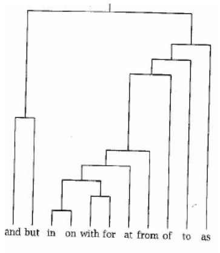

# Question 1
Let a 5 x 4 data matrix X be defined as below. Find the following, and show your work/calculations. Note: You don't need to use any functions/packages on this question-- you should compute by hand.

```{r}
X <- matrix(c(-1,-2,4,2,0,0,-2,2,2,-1,-1,3,3,0,0,2,2,-3,1,1),nrow=5,byrow = T)
print(X)
```

a) Find the Euclidean distance between the first and second objects. Round the answer to have two decimal points. 
$(\sum_{k = 1}^{4} (x_{1k} - x_{2k}) ^2))^\frac{1}{2} = \sqrt((-1-0)^2 + (-2-0)^2 + (4 - -2)^2 + (2-2)^2) = 6.40$ 

b) Find the Manhattan distance between the first and third objects. Round the answer to have two decimal points.
$\sum_{k = 1}^{4}|x_{1k} - x_{2k}| = |-1-2| + |-2--1| + |4--1| + |2-3| = 10.00$ 

c) Find the Minkowski distance ( $\rho$ = 3) between the second and third objects. Round the answer to have two decimal points.  
$(\sum_{k = 1}^{4}|x_{1k} - x_{2k}|^p)^\frac{1}{p} = (|0-2|^3 + |0--1|^3 + |-2--1|^3 + |2-3|^3)^\frac{1}{3} = 2.22$ 

# Question 2
a) Use the filter and select commands to choose only vans from the `Cars93` data set. Select the variables (in this order) Model, Price, EngineSize, Horsepower, MPG.highway, and Length. Name this object `Vans93`. Note: Be sure to load the dplyr package after loading MASS to prevent masking of the select command. How many objects does `Vans93` have? Print the `Vans93` dataframe in your solutions. Note2: If you get any errors with `select()`, try using `dplyr::select()` to avoid conflicts in `dplyr` and `MASS` packages.
```{r}
library(dplyr)
library(MASS)

data(Cars93)
Vans93 <- Cars93 %>% filter(Type=='Van') %>% dplyr::select(Model, Price, EngineSize, Horsepower, MPG.highway, Length)
```

b) Use the `dist` and `as.matrix` functions to find the distance matrix for the vans set using the Euclidean metric. Call this matrix `Vans_Euclidean`. You will need to remove the first column of the `Vans93` dataframe when you pass it into the `dist` function, since the variable `Model` is not an appropriate variable for the cluster variate. You can do this by passing in `Vans93[,-1]` or `Vans93[,2:6]` (or any other way you like), converting it to a matrix and storing it as `Vans_Euclidean`. Next, set the row and column names of `Vans_Euclidean` to the Models of the vans using the rownames and colnames functions, so that it is easier for us to see what object we have in each row/column. Hint: This can be done by typing 

```{r, eval=F}
colnames(Vans_Euclidean)<-Vans93[,1]
rownames(Vans_Euclidean)<-Vans93[,1]
```

Finally, round the values in this matrix to the hundredths place (two decimal points). Paste the final version of the matrix `Vans_Euclidean` into your solutions. Which two Vans (give the models) have the shortest distance between them? Which two have the largest distance between them?
```{r}
Vans_Euclidean<-as.matrix(dist(Vans93[,-1]))
colnames(Vans_Euclidean)<-Vans93[,1]
rownames(Vans_Euclidean)<-Vans93[,1]
Vans_Euclidean<-round(Vans_Euclidean,2)
Vans_Euclidean
```

The vans with the shortest distance between them are the Caravan and the Aerostar (3.44). The vans with the largest distance between them are the Lumina APV and the Eurovan (61.8).

c) Repeat the steps in part (b) but use the Manhattan metric and call the object `Vans_Manhattan`.
```{r}
Vans_Manhattan<-as.matrix(dist(Vans93[,-1],method="manhattan"))
colnames(Vans_Manhattan)<-Vans93[,1]
rownames(Vans_Manhattan)<-Vans93[,1]
Vans_Manhattan
```

The vans with the shortest distance between them are the Quest and the MPV (5.0). The vans with the largest distance between them are the Lumina APV and the Eurovan (76.7).

# Question 3
Suppose you are given the following 6 x 6 *distance matrix*:
```{r}
D <- matrix(c(0,1,9,2,1.6,8,1,0,3,6,9,4,9,3,0,5,10,3,2,6,5,0,2,7.5,1.6,9,10,2,0,5.5,8,4,3,7.5,5.5,0),nrow=6,byrow = T)
print(D)
```

Find (by hand) the inter-group distance between A = $\{O_1, O_4\}$ and B = $\{O_2, O_3, O_5\}$ (where $O_n$ denotes the $n$th object in the distance matrix **D**) using

a) Nearest-neighbor

= min{ d12, d13, d15, d42, d43, d45 }
= min{1, 9, 1.6, 6, 5, 2}
= 1

b) Farthest-neighbor
= max{ d12, d13, d15, d42, d43, d45 }
= max{1, 9, 1.6, 6, 5, 2}
= 9


c) Average-neighbor
= 1/6 (d12 + d13 + d15 + d42 + d43 + d45 )
= 1/6 (1 + 9 + 1.6 + 6 + 5 + 2)
= 24.6/6 
= 4.1

# Question 4
Consider the following dendrogram created by a hierarchical clustering of 11 frequently used English words.



Using this dendrogram, break these 11 words into five clusters. Call them $C_1 – C_5$ and put their members inside curly brackets, e.g. $C_2 = \{with, for\}$. Comment on your grouping using 1-2 sentences.

Cutting the dendrogram just above the node that splits the objects and \& but gives 5 intersections in total, leading to 5 clusters: C1: {and, but} C2: {in,on,with,for,at,from} C3: {of} C4: {to} C5: {as}. Notice the objects that are grouped in the same clusters: and \& but are conjunctions; in, on with, for, at, from are prepositions. of, to, as are grouped separately as they are different word types.

# Question 5
Let's practice hierarchical clustering with the `vertebrate` dataset that is saved in data folder on GitHub. Animals are divided into two categories [vertebrates and invertebrates](https://www.oum.ox.ac.uk/thezone/animals/animalid/divide.htm#:~:text=Invertebrates%20-%20animals%20without%20a%20backbone,a%20vertebrate%20or%20an%20invertebrate.). Vertebrates are also divided within themselves into groups such as mammals, birds, reptiles.. Our task in this question is to identify groups within vertrabrates that share similar traits.

a) First, read in the `vertebrate.csv` file and store it in a dataframe object named `vertebrate`. How many rows does the dataframe have? Print the entire dataset in your solutions.
```{r}
vertebrate <- read.csv('vertebrate.csv')
```

b) Perform two separate clustering analyses of the data using the `hclust` function. Provide the dendrograms for both clustering methods.

(i)	using the Euclidean metric with complete linkage. Note: Similar to Question 2, start by creating a distance matrix named `vertebrate_euclidean` which should not include any text column. Add row and column names to the matrix from the `vertebrate` dataframe. Then apply `dist()` once again before feeding the matrix into `hclust()` function.
```{r}
Ver_Euclidean<-as.matrix(dist(vertebrate[,-1]))
colnames(Ver_Euclidean)<-vertebrate[,1]
rownames(Ver_Euclidean)<-vertebrate[,1]
vertebrate_HC_1<-hclust(dist(Ver_Euclidean))
plot(vertebrate_HC_1,lwd=3,cex.lab=1.25,hang=-1,main="Clustered vertebrates, Euclidean Metric,\n Complete Linkage",xlab="Vertebrates",sub= "")
```

(ii)using the Manhattan metric with single linkage and
```{r}
Ver_Manhattan<-as.matrix(dist(vertebrate[,-c(1,8)],method="manhattan"))
colnames(Ver_Manhattan)<-vertebrate[,1]
rownames(Ver_Manhattan)<-vertebrate[,1]
vertebrate_HC_2<-hclust(dist(Ver_Manhattan,method="manhattan"),method="single")
plot(vertebrate_HC_2,lwd=3,cex.lab=1.25,hang=-1,main="Clustered vertebrates, Manhattan Metric,\n Single Linkage",xlab="Vertebrates",sub= "")
```

Which method do you prefer?


In your dendrograms:

*	Set the line width to 3 using `lwd=3`
*	Set the title to "Clustered vertebrates, Metric type,\n Linkage type" (You should enter the metric and linkage used in the clustering.)
*	Remove the subtitle by setting `sub=""`.
*	Set the x-axis label to Vertebrates using `xlab="Vertebrates"` with `cex.lab=1.25`
*	Have the terminal edges extend to a height of zero by setting `hang=-1` such that labels appear on the same vertical height.


I prefer the first dendrogram since it more naturally leads to 3 clusters, instead of 2 as the second dendrogram suggests. I prefer to keep leopard shark and whale as a separate group, but a preference for two groups is also fine.

Bonus: (not required) In case you are curious on how to do generate this dendogram using `ggplot2`, here is an implementation. (Make sure to install the `ggdendro` package before running.)

```{r, eval=T}
library(tidyverse)
library(ggdendro)

dd <- as.matrix(dist(vertebrate[,-c(1,8)], method = "euclidean"))
colnames(dd)<-vertebrate[,1]
rownames(dd)<-vertebrate[,1]
hc <- hclust(dist(dd))

set_labels_params <- function(nbLabels,
                              direction = c("tb", "bt", "lr", "rl"),
                              fan       = FALSE) {
  if (fan) {
    angle       <-  360 / nbLabels * 1:nbLabels + 90
    idx         <-  angle >= 90 & angle <= 270
    angle[idx]  <-  angle[idx] + 180
    hjust       <-  rep(0, nbLabels)
    hjust[idx]  <-  1
  } else {
    angle       <-  rep(0, nbLabels)
    hjust       <-  0
    if (direction %in% c("tb", "bt")) { angle <- angle + 45 }
    if (direction %in% c("tb", "rl")) { hjust <- 1 }
  }
  list(angle = angle, hjust = hjust, vjust = 0.5)
}

dendro_data_k <- function(hc, k) {
  
  hcdata    <-  ggdendro::dendro_data(hc, type = "rectangle")
  seg       <-  hcdata$segments
  labclust  <-  cutree(hc, k)[hc$order]
  segclust  <-  rep(0L, nrow(seg))
  heights   <-  sort(hc$height, decreasing = TRUE)
  height    <-  mean(c(heights[k], heights[k - 1L]), na.rm = TRUE)
  
  for (i in 1:k) {
    xi      <-  hcdata$labels$x[labclust == i]
    idx1    <-  seg$x    >= min(xi) & seg$x    <= max(xi)
    idx2    <-  seg$xend >= min(xi) & seg$xend <= max(xi)
    idx3    <-  seg$yend < height
    idx     <-  idx1 & idx2 & idx3
    segclust[idx] <- i
  }
  
  idx                    <-  which(segclust == 0L)
  segclust[idx]          <-  segclust[idx + 1L]
  hcdata$segments$clust  <-  segclust
  hcdata$segments$line   <-  as.integer(segclust < 1L)
  hcdata$labels$clust    <-  labclust
  
  hcdata
}


plot_ggdendro <- function(hcdata,
                          direction   = c("lr", "rl", "tb", "bt"),
                          fan         = FALSE,
                          scale.color = NULL,
                          branch.size = 1,
                          label.size  = 3,
                          nudge.label = 0.01,
                          expand.y    = 0.1) {
  
  direction <- match.arg(direction) # if fan = FALSE
  ybreaks   <- pretty(segment(hcdata)$y, n = 5)
  ymax      <- max(segment(hcdata)$y)
  
  ## branches
  p <- ggplot() +
    geom_segment(data         =  segment(hcdata),
                 aes(x        =  x,
                     y        =  y,
                     xend     =  xend,
                     yend     =  yend,
                     linetype =  factor(line),
                     colour   =  factor(clust)),
                 lineend      =  "round",
                 show.legend  =  FALSE,
                 size         =  branch.size)
  
  ## orientation
  if (fan) {
    p <- p +
      coord_polar(direction = -1) +
      scale_x_continuous(breaks = NULL,
                         limits = c(0, nrow(label(hcdata)))) +
      scale_y_reverse(breaks = ybreaks)
  } else {
    p <- p + scale_x_continuous(breaks = NULL)
    if (direction %in% c("rl", "lr")) {
      p <- p + coord_flip()
    }
    if (direction %in% c("bt", "lr")) {
      p <- p + scale_y_reverse(breaks = ybreaks)
    } else {
      p <- p + scale_y_continuous(breaks = ybreaks)
      nudge.label <- -(nudge.label)
    }
  }
  
  # labels
  labelParams <- set_labels_params(nrow(hcdata$labels), direction, fan)
  hcdata$labels$angle <- labelParams$angle
  
  p <- p +
    geom_text(data        =  label(hcdata),
              aes(x       =  x,
                  y       =  y,
                  label   =  label,
                  colour  =  factor(clust),
                  angle   =  angle),
              vjust       =  labelParams$vjust,
              hjust       =  labelParams$hjust,
              nudge_y     =  ymax * nudge.label,
              size        =  label.size,
              show.legend =  FALSE)
  
  # colors and limits
  if (!is.null(scale.color)) {
    p <- p + scale_color_manual(values = scale.color)
  }
  
  ylim <- -round(ymax * expand.y, 1)
  p    <- p + expand_limits(y = ylim)
  
  p
}


hcdata <- dendro_data_k(hc, 3) 
plot_ggdendro(hcdata, direction = "lr", expand.y = 0.2) # try fan = TRUE

```


You are done! 🏁 Don't forget to commit and push your .Rmd file to your Github repository before the due date.


